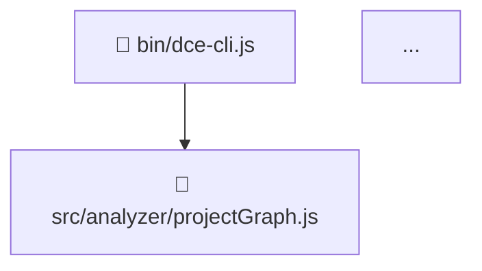

# 📖 Dokumentasi Proyek: Deadkiller CLI

> Alat eliminasi dead code dan unused dependency otomatis untuk proyek JavaScript.
> Dibuat sebagai bagian dari Tugas Akhir menggunakan pendekatan **Graph-Based Reachability Analysis** + **Scope-Aware AST Analysis**.

---

## 📂 Struktur Direktori

```
.
├── bin/
│   └── dce-cli.js              # Entry point CLI — mengatur semua command
├── src/
│   ├── parser/
│   │   └── astParser.js        # Konversi source code → AST (Acorn)
│   ├── analyzer/
│   │   ├── projectGraph.js     # BFS Graph builder — inti reachability
│   │   ├── graphVisualizer.js  # Generator diagram Mermaid
│   │   ├── deadcode/
│   │   │   ├── deadCodeAnalyzer.js  # Detektor dead code utama
│   │   │   ├── scope.js             # Kelas Scope (Scope Tree)
│   │   │   └── utils.js             # Helper isReference()
│   │   └── dependency/
│   │       └── dependencyAnalyzer.js # Detektor unused dependencies
│   └── eliminator/
│       ├── codeCleaner.js      # Hapus dead code dari AST → regenerasi kode
│       ├── dependencyCleaner.js # Hapus entry dari package.json
│       └── diffGenerator.js   # Preview diff berwarna di terminal
├── test/
│   ├── single_scan_test.js     # File dummy untuk uji single-file scan
│   └── test-metrics/           # Proyek dummy untuk uji mode fix & metrics
├── index.js                    # Dummy manual test (bukan bagian CLI)
├── package.json
└── readme.md
```

---

## 🧠 Alur Kerja Keseluruhan

```
Pengguna → CLI (dce-cli.js)
              │
              ├──[scan/fix]──► buildProjectGraph() ──► BFS dari entry point
              │                      │
              │              ┌───────┴────────┐
              │              ▼                ▼
              │         Deteksi import    Bailout Heuristics
              │         (liveFiles,       (eval, with, obj[x])
              │          usedPackages)
              │              │
              │    ┌─────────┴────────────┐
              │    ▼                      ▼
              │ deadCodeAnalyzer()   findUnusedDependencies()
              │ (Scope Tree → DCE)   (pkg.json vs import scan)
              │
              ├──[fix]──► diffGenerator() → Tampil diff warna
              │           · Konfirmasi user (Inquirer)
              │           · codeCleaner() → Tulis file bersih
              │           · dependencyCleaner() → Update package.json
              │           · Cetak Impact Metrics
              │
              └──[visualize]──► generateMermaidGraph() → project-graph.mmd
```

---

## 📋 Penjelasan Per File

### `bin/dce-cli.js` — Entry Point CLI

**Kegunaan:** Mengatur semua perintah CLI menggunakan library `commander`.

| Command            | Deskripsi                                      |
| ------------------ | ---------------------------------------------- |
| `scan <path>`      | Pindai, tampilkan laporan, tanpa mengubah file |
| `fix <path>`       | Pindai → preview diff → konfirmasi → eksekusi  |
| `show-deps <path>` | Tampilkan semua dependencies di `package.json` |
| `visualize <path>` | Generate diagram Mermaid dependensi proyek     |

**Logika `scan`:**

1. Deteksi apakah path adalah file tunggal atau direktori
2. Jika direktori → bangun graf → deteksi dead files, unused deps, dead code
3. Cetak laporan + waktu analisis

**Logika `fix`:**

1. Bangun graf → analisis semua issue
2. Kalkulasi LOC & ukuran file di memori (sebelum & sesudah)
3. Tampilkan diff berwarna + warning untuk unsafe files
4. Prompt konfirmasi interaktif via Inquirer
5. Eksekusi: hapus deps → hapus dead files → tulis kode bersih
6. Cetak `📊 Impact Metrics` (LOC removed, KB saved, execution time)

---

### `src/parser/astParser.js` — Parser AST

**Kegunaan:** Konversi string source code JavaScript menjadi Abstract Syntax Tree (AST).

**Library:** `acorn`

**Konfigurasi:**

- `ecmaVersion: "latest"` → Mendukung sintaks ES2022+ (termasuk dynamic `import()`)
- `sourceType: "module"` → Mendukung `import`/`export` (ESM)
- `locations: true` → Setiap node AST menyimpan informasi nomor baris

**Dipanggil oleh:** Hampir semua modul lain yang butuh parsing

---

### `src/analyzer/projectGraph.js` — Graph Builder (Inti BFS)

**Kegunaan:** Membangun peta ketergantungan seluruh proyek dari entry point menggunakan Breadth-First Search (BFS).

**Input:** Path root proyek  
**Output:** `{ liveFiles, usedPackages, edges, unsafeFiles, globalRegistry }`

**Langkah-langkah:**

1. **Deteksi Entry Point** → Baca `package.json` (field `main` & `bin`). Fallback ke `index.js`, `main.js`, `app.js`, dll.
2. **BFS Traversal** → Dari entry point, telusuri semua `import`/`require` secara rekursif. File yang bisa dicapai → `liveFiles`.
3. **Single AST Pass** — dalam satu traversal per file, lakukan 3 hal:
   - 🚨 **Bailout Heuristics:** Tandai `unsafeFiles` jika ada `eval()`, `with`, atau `obj[dynamicKey]`
   - 📞 **Call Graph:** Catat semua function/identifier yang dipanggil → `globalRegistry.usages`
   - 📦 **Import Tracking:** Pisahkan import lokal (relative) vs package (node_modules)
4. **Resolusi Path** (`resolvePath`) → Coba berbagai ekstensi (`.js`, `.mjs`, `.cjs`, `.json`) dan fallback ke `index.js` di dalam folder.
5. **Sweep Phase** → Di akhir, rekonsiliasi `exports` vs `usages` untuk update status `isUnused` di `globalRegistry`.

**File yang tidak masuk `liveFiles` = Dead Files (file sampah/yatim)**

---

### `src/analyzer/deadcode/scope.js` — Kelas Scope

**Kegunaan:** Implementasi **Scope Tree** yang merepresentasikan hierarki cakupan variabel JavaScript.

```
Global Scope
  └── Function Scope (setiap function membuat scope baru)
        └── Block Scope ({ let/const di dalam blok })
```

| Method                                   | Fungsi                                                                                                                  |
| ---------------------------------------- | ----------------------------------------------------------------------------------------------------------------------- |
| `addDeclaration(name, type, line, node)` | Daftarkan variabel/fungsi ke scope ini                                                                                  |
| `addReference(name)`                     | Catat bahwa identifier ini digunakan                                                                                    |
| `resolve()`                              | Jalankan markUsed() untuk semua referensi yang dicatat                                                                  |
| `markUsed(name)`                         | Tandai deklarasi sebagai terpakai; jika tidak ada di scope ini, **naik ke parent** (ini logika scope chain JavaScript!) |

**Properti:**

- `declarations` → Map: `name → { type, line, node, used: false }`
- `references` → Array nama identifier yang digunakan di scope ini
- `parent` → Referensi ke scope induk

---

### `src/analyzer/deadcode/utils.js` — Helper `isReference()`

**Kegunaan:** Menjawab satu pertanyaan kritis: **"Apakah kemunculan identifier ini adalah penggunaan (referensi), atau sekadar nama deklarasi?"**

Tanpa ini, nama fungsi saat dideklarasikan: `function foo() {}` akan salah dihitung sebagai "terpakai".

| Kasus                                 | Hasil                                |
| ------------------------------------- | ------------------------------------ |
| `const x = 1` (x di sisi kiri)        | ❌ Bukan referensi                   |
| `console.log(x)` (x di argumen)       | ✅ Referensi                         |
| `function foo() {}` (nama foo)        | ❌ Bukan referensi                   |
| `{ key: val }` (key di objek literal) | ❌ Bukan referensi                   |
| `obj.prop` (prop setelah titik)       | ❌ Bukan referensi (properti statis) |

---

### `src/analyzer/deadcode/deadCodeAnalyzer.js` — Detektor Dead Code

**Kegunaan:** Menganalisis AST untuk menemukan variabel, fungsi, dan branch yang tidak pernah digunakan.

**Menggunakan:** `Scope`, `isReference`, `estraverse`

**3 Fase Analisis:**

**Fase 1 — Bangun Scope Tree:**

- Buat `Scope` baru setiap kali masuk `FunctionDeclaration`, `FunctionExpression`, `ArrowFunctionExpression`, atau `BlockStatement`
- Daftarkan setiap `VariableDeclarator` dan `FunctionDeclaration` ke scope yang tepat
- Catat setiap `Identifier` yang merupakan referensi
- Deteksi **Dead Branch**: `if (false) { ... }` → langsung tandai body sebagai unreachable node

**Fase 2 — Tangani Export dengan Aman:**

- `export const x` / `export function foo` → **jangan** tandai dead code jika digunakan di file lain (dicek lewat `globalRegistry`)
- Mendukung ESM (`export`) dan CommonJS (`module.exports`)

**Fase 3 — Resolve & Kumpulkan:**

- `scope.resolve()` di semua scope → jalankan marking
- Kumpulkan semua deklarasi dengan `used === false` → ini dead code

**Export:** `findDeadCode(ast, fileName, globalRegistry)`

---

### `src/analyzer/dependency/dependencyAnalyzer.js` — Detektor Unused Deps

**Kegunaan:** Menemukan package di `package.json` yang tidak pernah di-import dalam kode.

**Logika:** `Set(package.json) - Set(import yang ditemukan di kode) = Unused`

| Fungsi                         | Tugas                                                                                    |
| ------------------------------ | ---------------------------------------------------------------------------------------- |
| `getPackageDependencies(root)` | Baca `package.json`, return Set nama package                                             |
| `getPackageName(importPath)`   | Ekstrak base package dari string import (handle scoped `@scope/pkg`)                     |
| `getUsedDependencies(root)`    | Scan semua file JS, traversal AST, deteksi `import`, `require()`, dan `import()` dinamis |
| `findUnusedDependencies(root)` | Fungsi utama: panggil keduanya, return selisihnya                                        |

---

### `src/analyzer/graphVisualizer.js` — Generator Mermaid

**Kegunaan:** Mengubah objek graf (`liveFiles`, `edges`) menjadi teks diagram Mermaid.

**Output:** File `project-graph.mmd` berisi definisi diagram:



Bisa divisualisasikan di:

- VSCode dengan ekstensi **Mermaid Preview**
- [mermaid.live](https://mermaid.live)

---

### `src/eliminator/codeCleaner.js` — Pembersih Dead Code (Level AST)

**Kegunaan:** Menghapus node dead code dari AST lalu meng-generate ulang kode yang bersih.

**Mengapa di level AST?** → Lebih aman dari manipulasi string; tidak ada risiko hapus baris yang salah.

**Logika `removeDeadCode(ast, deadNodes)`:**

1. Buat `Set` dari node AST yang harus dihapus (pakai referensi objek langsung)
2. `estraverse.replace()` → jika node ada di Set → return `VisitorOption.Remove`
3. Fase `leave`: jika `VariableDeclaration` kosong (semua declarator-nya dihapus) → hapus wrapper-nya juga
4. `escodegen.generate()` → ubah AST kembali ke string kode dengan format rapi

**Opsi output:** 4 spasi indent, single quotes, komentar dipertahankan.

---

### `src/eliminator/dependencyCleaner.js` — Pembersih `package.json`

**Kegunaan:** Menghapus entry unused dependencies dari `package.json`.

**Logika:** Baca JSON → hapus key dari `dependencies` dan `devDependencies` → tulis kembali dengan format 2 spasi.

---

### `src/eliminator/diffGenerator.js` — Generator Diff Berwarna

**Kegunaan:** Menampilkan perbandingan kode "sebelum vs sesudah" di terminal dengan warna.

**Menggunakan:** Library `diff` (Unified Diff) + `chalk` (pewarnaan terminal)

| Warna      | Arti                          |
| ---------- | ----------------------------- |
| 🔴 Merah   | Baris yang dihapus            |
| 🟢 Hijau   | Baris yang ditambahkan        |
| 🔵 Cyan    | Header hunk `@@ -x,y +x,y @@` |
| ⚫ Abu-abu | Konteks (tidak berubah)       |

---

### `index.js` — Dummy Manual Test

File ini **bukan bagian CLI**. Digunakan untuk validasi awal secara manual. Berisi kode inline dengan dead code yang sengaja dibuat, lalu menjalankan pipeline `parse → analyze → remove` dan mencetak hasilnya.

> ⚠️ **Catatan:** File ini sengaja dibiarkan sebagai target self-analysis tool (untuk membuktikan tool bisa mendeteksi dirinya sendiri).

---

### `test/single_scan_test.js` — Target Uji Single-File Scan

File dummy yang sengaja berisi berbagai jenis isu untuk menguji kemampuan detektor:

```javascript
function unusedHelper() {
  return 1;
} // ← dead function
const used = 10;
console.log(used);
const unusedVar = 20; // ← dead variable

if (false) {
  console.log("Dead branch"); // ← dead branch
}
```

**Cara uji:** `node bin/dce-cli.js scan test/single_scan_test.js`

---

### `test/test-metrics/` — Proyek Dummy untuk Uji Metrics

Proyek kecil tersendiri (punya `package.json` sendiri) untuk menguji mode `fix` dan validasi perhitungan Impact Metrics (total LOC removed, total KB saved).

---

## 🔬 Algoritma Utama yang Diimplementasikan

| Algoritma                      | Diimplementasikan Di                     | Deskripsi                                                                        |
| ------------------------------ | ---------------------------------------- | -------------------------------------------------------------------------------- |
| **Breadth-First Search (BFS)** | `projectGraph.js`                        | Traversal dari entry point untuk membuat peta file yang live                     |
| **Scope Chain Analysis**       | `scope.js`, `deadCodeAnalyzer.js`        | Resolusi variabel dengan scope parent chain                                      |
| **Mark-and-Sweep (DCE)**       | `deadCodeAnalyzer.js`, `codeCleaner.js`  | Tandai deklarasi → tandai yang terpakai → sisanya adalah dead code               |
| **Bailout Heuristics**         | `projectGraph.js`                        | Deteksi kode dinamis (`eval`, `with`, computed property) → tandai sebagai unsafe |
| **Call Graph Registry**        | `projectGraph.js`, `deadCodeAnalyzer.js` | Cross-file tracking penggunaan fungsi                                            |
| **Constant Folding Detection** | `deadCodeAnalyzer.js`                    | Deteksi `if (false)` / `if (true)` untuk dead branch elimination                 |

---

## 🔗 Dependensi & Fungsinya

| Package      | Versi    | Fungsi                               |
| ------------ | -------- | ------------------------------------ |
| `acorn`      | ^8.15.0  | Parser JavaScript → AST              |
| `estraverse` | ^5.3.0   | Traversal & replace node AST         |
| `escodegen`  | ^2.1.0   | Regenerasi source code dari AST      |
| `commander`  | ^14.0.2  | Framework CLI (argument parsing)     |
| `fast-glob`  | ^3.3.3   | Scanning file secara efisien         |
| `diff`       | ^8.0.3   | Generate unified diff string         |
| `chalk`      | ^5.6.2   | Pewarnaan output terminal            |
| `inquirer`   | ^12.11.1 | Input interaktif (checkbox, confirm) |
| `fs-extra`   | ^11.3.3  | Operasi file system yang lebih kaya  |

---

## 💡 Tips Penggunaan

```bash
# Scan single file
node bin/dce-cli.js scan test/single_scan_test.js

# Scan seluruh proyek
node bin/dce-cli.js scan ./

# Fix dengan preview diff
node bin/dce-cli.js fix ./path/to/project

# Lihat semua dependencies
node bin/dce-cli.js show-deps ./

# Generate diagram ketergantungan
node bin/dce-cli.js visualize ./
# → Hasilnya: project-graph.mmd (buka di mermaid.live)
```

---

_Dokumentasi ini dibuat pada 2026-03-06 berdasarkan analisis langsung terhadap source code proyek._
