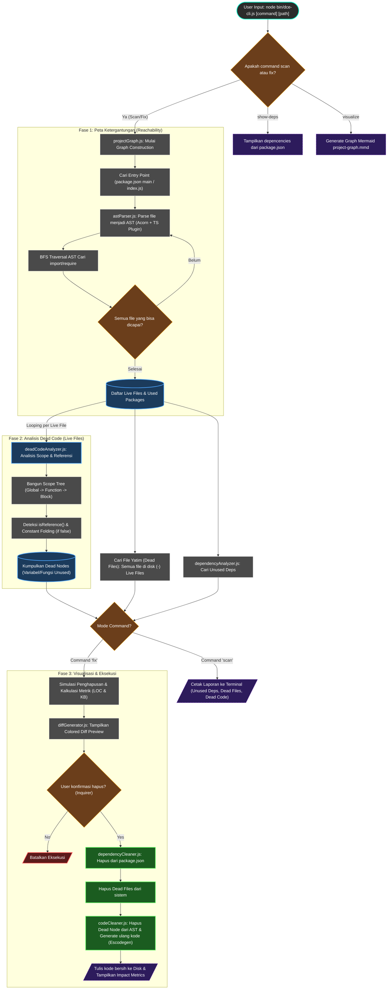

# Rancang Bangun Alat Eliminasi Dead Code dan Unused Dependency Otomatis untuk Proyek JavaScript

## 📄 Abstrak

Proyek Tugas Akhir ini mengembangkan alat bantu (tool) berbasis _Command Line Interface_ (CLI) untuk melakukan _static analysis_ mendalam pada kode sumber JavaScript. Alat ini menggunakan pendekatan **Graph-Based Reachability Analysis** untuk memetakan struktur proyek secara akurat, mendeteksi file yang tidak terjangkau (_unreachable files_), variabel mati (_dead code_), serta dependensi yang tidak terpakai (_unused dependencies_). Dilengkapi dengan fitur **Diff View** untuk memvisualisasikan perubahan sebelum dieksekusi demi keamanan kode.

## 🚀 Fitur Utama

- **Deep Graph Analysis**: Membangun graf ketergantungan dari _entry point_ (misal `index.js`) untuk membedakan antara file yang _live_ dan file sampah (_dead files_).
- **Unused Dependency Detection**: Mendeteksi library di `package.json` yang tidak pernah dipanggil di file manapun dalam graf proyek.
- **Intra-procedural Dead Code Elimination**: Mendeteksi deklarasi variabel/fungsi yang tidak digunakan di dalam file yang aktif (Scope-Aware Analysis).
- **Interactive Diff Preview**: Menampilkan perbandingan kode **Before vs After** (seperti Github Diff) di terminal sebelum melakukan penghapusan.
- **Auto-Detection Entry Point**: Otomatis mendeteksi file utama proyek dari `package.json` atau standar umum.
- **Safe Mode**: Public API (`export`) dilindungi, dan konfirmasi interaktif diwajibkan sebelum perubahan fisik.

## 🛠️ Teknologi yang Digunakan

- **Node.js**: Runtime environment.
- **Acorn & Estraverse**: Parser AST dan penelusuran kode.
- **Escodegen**: Code generator untuk menyusun ulang AST.
- **Commander**: Framework CLI.
- **Fast-Glob**: Scanning file sistem.
- **Diff & Chalk**: Visualisasi perbedaan kode berwarna.
- **Inquirer**: Interaksi antarmuka pengguna CLI.

## 📦 Instalasi

1.  Clone repositori ini.
2.  Install dependensi:
    ```bash
    npm install
    ```

## 📖 Cara Penggunaan

### 1. Mode Scan (Analisis & Laporan)

Menampilkan laporan lengkap kesehatan kode tanpa mengubah apapun.

```bash
node bin/dce-cli.js scan <path_project>
```

**Output mencakup:**

- Daftar Dependensi Tidak Terpakai.
- Daftar File Mati (Tidak Pernah Di-import).
- Daftar Kode Mati (Variabel/Fungsi Unused) di dalam file aktif.

### 2. Mode Fix (Pembersihan Cerdas)

Melakukan analisis, menampilkan preview perubahan, dan mengeksekusi pembersihan.

```bash
node bin/dce-cli.js fix <path_project>
```

**Alur Interaksi:**

1.  **Analisis**: Tool memindai proyek.
2.  **Laporan**: Menampilkan ringkasan isu.
3.  **Diff Preview**: Menampilkan kode asli vs kode baru (berwarna merah/hijau).
4.  **Konfirmasi**: `Are you sure you want to apply these changes? (y/N)`.

## 🧠 Logika Internal (Algoritma)

1.  **Fase 1: Graph Construction**
    - Mencari _Entry Point_ (misal `index.js`).
    - Menelusuri semua `import` / `require` secara rekursif (Breadth-First Search).
    - Menghasilkan daftar **Live Files**. File di folder proyek yang tidak masuk daftar ini dianggap **Dead Files**.

2.  **Fase 2: Dependency Check**
    - Mencatat semua paket eksternal yang di-import dalam Graph.
    - Membandingkan dengan `package.json`. Sisa yang tidak ada di Graph adalah **Unused Dependencies**.

3.  **Fase 3: Local Dead Code Analysis**
    - Hanya memindai **Live Files**.
    - Membangun **Scope Tree** (Global -> Function -> Block).
    - Menandai deklarasi yang _Reference Count_-nya 0 sebagai **Dead Code**.

4.  **Fase 4: Diff & Execution**
    - Simulasi penghapusan di memori.
    - Generate _Unified Diff_ string.
    - Tulis ke disk hanya jika dikonfirmasi user.

### Alur Kerja (Flowchart)



## 📂 Struktur Direktori

```
.
├── bin/
│   └── dce-cli.js           # Main CLI Logic (Graph + Diff Integration)
├── src/
│   ├── analyzer/
│   │   ├── projectGraph.js        # Logika Reachability Graph
│   │   ├── deadCodeAnalyzer.js    # Logika Scope & AST Analysis
│   │   └── dependencyAnalyzer.js  # Helper Dependency Check
│   ├── eliminator/
│   │   ├── diffGenerator.js       # Logika Visualisasi Diff
│   │   ├── codeCleaner.js         # Regenerasi Kode (Escodegen)
│   │   └── dependencyCleaner.js   # Update package.json
│   └── parser/
│       └── astParser.js           # Konfigurasi Parser
└── index.js                 # Dummy file untuk pengujian
```

## 🧪 Hasil Pengujian (Validasi)

Tool ini telah diuji pada dirinya sendiri (_Self-Analysis_) dan berhasil:

1.  Mendeteksi file-file sisa pengembangan yang tidak terhubung ke `dce-cli.js`.
2.  Mendeteksi dependensi dev yang tidak terpakai (jika ada).
3.  Mendeteksi variabel dummy seperti `unusedVar` dengan tepat tanpa merusak kode di sekitarnya.
