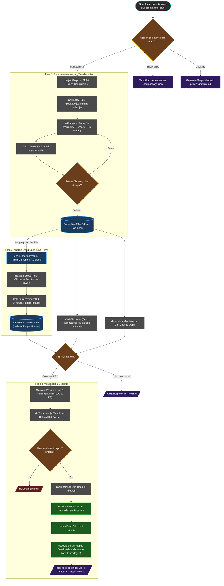
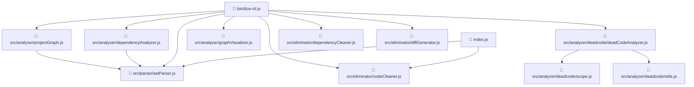

# Rancang Bangun Alat Eliminasi Dead Code dan Unused Dependency Otomatis untuk Proyek JavaScript

## 📄 Abstrak
Proyek Tugas Akhir ini mengembangkan alat bantu (tool) berbasis _Command Line Interface_ (CLI) untuk melakukan _static analysis_ mendalam pada kode sumber JavaScript. Alat ini menggunakan pendekatan **Graph-Based Reachability Analysis** untuk memetakan struktur proyek secara akurat, mendeteksi file yang tidak terjangkau (_unreachable files_), variabel mati (_dead code_), serta dependensi yang tidak terpakai (_unused dependencies_). Dilengkapi dengan fitur **Diff View** untuk memvisualisasikan perubahan sebelum dieksekusi demi keamanan kode.

## 🚀 Fitur Utama
- **Deep Graph Analysis**: Membangun graf ketergantungan dari _entry point_ (misal `index.js`) untuk membedakan antara file yang _live_ dan file sampah (_dead files_).
- **Unused Dependency Detection**: Mendeteksi library di `package.json` yang tidak pernah dipanggil di file manapun dalam graf proyek.
- **Intra-procedural Dead Code Elimination**: Mendeteksi deklarasi variabel/fungsi yang tidak digunakan di dalam file yang aktif (Scope-Aware Analysis).
- **Interactive Diff Preview**: Menampilkan perbandingan kode **Before vs After** (seperti Github Diff) di terminal sebelum melakukan penghapusan.
- **Auto-Detection Entry Point**: Otomatis mendeteksi file utama proyek dari `package.json` atau standar umum.
- **Safe Mode**: Public API (`export`) dilindungi melalui Rule Engine, dan konfirmasi interaktif diwajibkan sebelum perubahan fisik menggunakan Backup otomatis.

## 📦 Instalasi

1.  Clone repositori ini.
2.  Install dependensi:
    ```bash
    npm install
    ```

## 📖 Cara Penggunaan (Panduan CLI)

### 1. Mode Scan (Analisis & Laporan)
Menampilkan laporan lengkap kesehatan kode tanpa mengubah apapun.
```bash
node bin/dce-cli.js scan <path_project>
```

### 2. Mode Fix (Pembersihan Cerdas)
Melakukan analisis, menampilkan preview perubahan, membuat backup, dan mengeksekusi pembersihan.
```bash
node bin/dce-cli.js fix <path_project>
```

### 💡 Tips Penggunaan Lainnya
```bash
# Lihat semua dependencies terdaftar di package.json
node bin/dce-cli.js show-deps ./

# Generate diagram ketergantungan antar file (hasil: project-graph.mmd)
node bin/dce-cli.js visualize ./

# Scan proyek TypeScript
node bin/dce-cli.js scan ./my-ts-project

# Jalankan automated test suite
npm test
```

## 🧠 Arsitektur dan Alur Kerja Keseluruhan

### Flowchart Proyek



## 📂 Struktur Direktori Lengkap

```text
.
├── bin/
│   └── dce-cli.js                    # Entry point CLI — mengatur semua command
├── src/
│   ├── parser/
│   │   └── astParser.js              # Konversi source code → AST (Acorn + TypeScript)
│   ├── analyzer/
│   │   ├── projectGraph.js           # BFS Graph builder — inti reachability analysis
│   │   ├── graphVisualizer.js        # Generator diagram Mermaid (.mmd)
│   │   ├── ruleEngine.js             # Mesin aturan keamanan dari .deadkillerrc.json
│   │   ├── deadcode/
│   │   │   ├── branchAnalyzer.js     # Deteksi unreachable branch (after-terminator/constant folding)
│   │   │   ├── deadCodeAnalyzer.js   # Koordinator analisis dead code utama
│   │   │   ├── destructuringExtractor.js # Ekstraksi parameter dari object/array pattern
│   │   │   ├── exportAnalyzer.js     # Analisis export dependencies antar modul
│   │   │   ├── isReference.js        # Helper isReference() (pengganti utils.js)
│   │   │   ├── scope.js              # Kelas Scope (Scope Tree chain)
│   │   │   └── scopeHelpers.js       # Helper resolusi hirarki function scope
│   │   └── dependency/
│   │       └── dependencyAnalyzer.js # Standalone detektor unused dependencies
│   └── eliminator/
│       ├── backupManager.js          # Pembuatan file backup checkpoint sebelum mode `fix`
│       ├── codeCleaner.js            # Hapus dead code dari AST → regenerasi kode
│       ├── dependencyCleaner.js      # Hapus entry dari package.json
│       └── diffGenerator.js          # Preview diff berwarna di terminal
```

### 🕸️ Peta Ketergantungan Internal (Dependency Graph)
Berikut adalah visualisasi keterhubungan antarmodul dalam program, dipetakan secara statis menggunakan perintah `visualize`:



## 📋 Penjelasan Modul Inti

### `src/analyzer/projectGraph.js` (Graph Builder)
Membangun peta ketergantungan seluruh proyek dari entry point menggunakan Breadth-First Search (BFS). Menentukan file mana yang "hidup" (live) dan mana yang tidak terjangkau (dead). Algoritma ini memiliki 3 fase penting: Mendeteksi _Bailout Heuristics_ (kode statis dinamis tak aman seperti `eval`), _Import Tracking_, dan pendeteksian komponen Skalabel.

### `src/analyzer/ruleEngine.js` (Engine Validasi Kebijakan)
Mesin regex yang menyeleksi sebuah file/dead code aman dihapus atau diselamatkan. Dikonfigurasi melalui file lokal `.deadkillerrc.json` (Misalnya opsi menolak menghapus semua fitur _export_ menggunakan `preserveExports`).

### `src/analyzer/deadcode/` (Kluster Analisa Spesifik)
Bertugas menemukan semua *dead code* dalam satu file dengan bantuan AST dan pohon `scope.js`. Diorkestrasikan oleh koordinator utama bernama `deadCodeAnalyzer.js` yang memanggil `branchAnalyzer.js` (untuk kode jalur buntu statis), `isReference.js` (memvalidasi keterpakaian variabel), serta mengutamakan pemeriksaan ekspor global melalui `exportAnalyzer.js`.

### `src/eliminator/backupManager.js` (Pencatat Cadangan)
Mekanisme safe-layer. Menggandakan titik penyimpanan sistem file origin pada skema `.deadkiller_backup/backup_{timestamp}/` sehingga file tidak rusak saat operasi eksekusi mode `fix` dijalankan.

### `src/eliminator/codeCleaner.js` & `src/eliminator/dependencyCleaner.js`
Algojo eksekusi langsung. Bekerja di *memori komputer* untuk menghilangkan *tree nodes* yang rusak di kode (*codeCleaner.js* dengan `Estraverse`), dan di modul paket (*dependencyCleaner.js*), lalu menyimpan hasil modifikasi murni bersih (*Escodegen*).

## 🔗 Dependensi Pokok
- **Acorn** & **Acorn-TypeScript**: Untuk mem-parse string JavaScript/TypeScript menjadi AST.
- **Estraverse**: Traversal dan replace node di AST.
- **Escodegen**: Regenerasi source code utuh dari AST.
- **Commander.js** & **Inquirer**: Menyusun rangka arsitektur antarmuka CLI.
