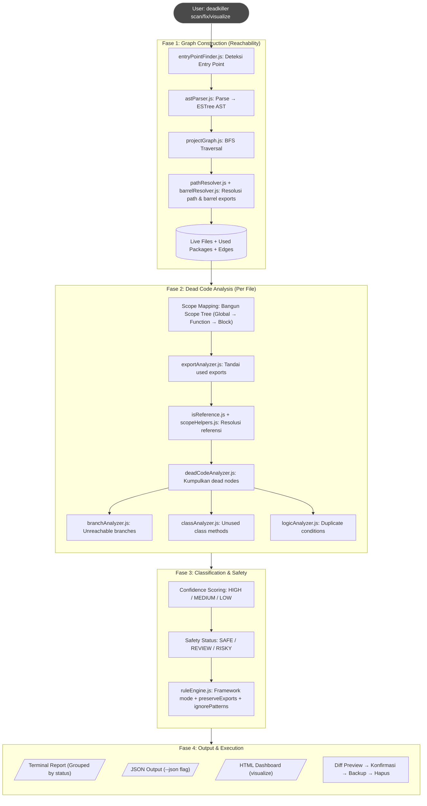

# ☠️ DeadKiller — Eliminasi Dead Code & Unused Dependency Otomatis untuk JavaScript

## 📄 Abstrak

Proyek Tugas Akhir ini mengembangkan alat bantu (tool) berbasis _Command Line Interface_ (CLI) bernama **DeadKiller** untuk melakukan _static analysis_ mendalam pada kode sumber JavaScript. Alat ini menggunakan pendekatan **Graph-Based Reachability Analysis** untuk memetakan struktur proyek secara akurat, mendeteksi file yang tidak terjangkau (_unreachable files_), variabel mati (_dead code_), serta dependensi yang tidak terpakai (_unused dependencies_).

Dilengkapi dengan **Confidence Scoring System** (High/Medium/Low) dan **Safety Classification** (Safe/Review/Risky) untuk memastikan setiap temuan dikategorikan secara akurat, serta fitur **Diff View**, **HTML Dashboard**, dan **Dark Mode** untuk pengalaman developer yang premium.

---

## 🚀 Fitur Utama

| Fitur | Deskripsi |
|-------|-----------|
| **Graph-Based Reachability** | Membangun graf ketergantungan dari entry point menggunakan BFS untuk membedakan file _live_ vs _dead_ |
| **Intra-procedural Dead Code** | Mendeteksi variabel, fungsi, parameter, dan kode yang tidak digunakan (scope-aware) |
| **Unused Dependency Detection** | Mendeteksi library di `package.json` yang tidak pernah di-import |
| **Confidence & Safety System** | Setiap temuan diberi label `high`/`medium`/`low` confidence + `safe`/`review`/`risky` status |
| **Interactive Diff Preview** | Preview perubahan Before vs After (Git-style) sebelum penghapusan |
| **HTML Dashboard + Graph** | Visualisasi interaktif dengan Cytoscape.js + dagre + orthogonal edge routing |
| **Dark Mode & Bilingual** | Dashboard mendukung Light/Dark mode dan bahasa Indonesia/English |
| **Safe Mode** | Export dilindungi, backup otomatis, konfirmasi interaktif, hanya `safe` yang di-auto-fix |
| **JSON Output** | Output terstruktur untuk integrasi CI/CD |
| **Watch Mode** | Real-time monitoring file changes + auto-scan |
| **Reverse Trace** | Lacak "siapa yang meng-import file X?" |
| **Framework-Aware** | Mode `vanilla` / `react` / `next` — otomatis proteksi direktori framework |

---

## 📦 Instalasi

1. Clone repositori ini.
2. Install dependensi:
   ```bash
   npm install
   ```
3. (Opsional) Link global agar bisa dipanggil dari mana saja:
   ```bash
   npm link
   ```

---

## 📖 Cara Penggunaan (8 Commands)

DeadKiller menyediakan **Interactive Wizard** dan **8 perintah CLI langsung**.

### 🌟 1. Interactive Wizard Mode (Rekomendasi)

```bash
node bin/dce-cli.js
```

Akan membuka menu interaktif yang memandu Anda memilih fitur. Cocok untuk pemula.

---

### 💻 2. Perintah CLI Langsung

#### `scan` — Pindai Dead Code (Dry Run)

Mengaudit proyek tanpa menghapus apapun. Menampilkan semua temuan dead code + unused dependency.

```bash
node bin/dce-cli.js scan <path>
```

**Opsi:**
- `--json` — Output dalam format JSON (untuk CI/CD pipeline)

```bash
node bin/dce-cli.js scan <path> --json
```

**Contoh Output:**
```
================================================
🟢 SAFE TO REMOVE (Aman untuk dihapus)
================================================

[Unused Variables]  HIGH
   -> src/utils.js
      Line 3: 'tempData' [SAFE]
      Line 12: 'unusedHelper' [SAFE]

[Unreachable Code]  HIGH
   -> src/handler.js
      Line 45: 'Unreachable Statement' [SAFE]

================================================
🟡 NEEDS REVIEW (Butuh peninjauan)
================================================

[Unused Functions]  MEDIUM
   -> src/utils.js
      Line 20: 'formatLegacy' [REVIEW]

[t] Analysis Time: 85 ms
```

---

#### `fix` — Hapus Dead Code (Dengan Konfirmasi)

Mendeteksi, menampilkan diff preview, meminta konfirmasi, lalu menghapus dead code. **Hanya item berstatus `safe`** yang dapat di-auto-fix.

```bash
node bin/dce-cli.js fix <path>
```

Fitur keamanan:
- Backup otomatis sebelum penghapusan (`backupManager.js`)
- Diff preview berwarna di terminal sebelum eksekusi
- Checkbox interaktif untuk memilih item yang dihapus
- Tipe `DuplicateCondition`, `Parameter`, `ClassMethod` **tidak** pernah di-auto-fix

---

#### `show-deps` — Analisis Dependensi

Memeriksa `package.json` dan menampilkan dependensi yang terpakai vs tidak terpakai.

```bash
node bin/dce-cli.js show-deps <path>
```

---

#### `visualize` — HTML Dashboard Interaktif

Menghasilkan dashboard HTML yang berisi:
- **Dependency Graph** interaktif (Cytoscape.js + dagre layout + orthogonal edge routing)
- **Dead Code Report** (tabel Safe/Review/Risky + Dead Files)
- **Used vs Unused Dependencies** sidebar
- **Dark Mode toggle** 🌓 + **Bilingual** (ID/EN)

```bash
node bin/dce-cli.js visualize <path>
```

Output: `code-structure-trace.html` → auto-open di browser default.

---

#### `trace` — Reverse Import Trace

Menjawab pertanyaan: **"Siapa yang meng-import file X?"**

```bash
node bin/dce-cli.js trace <file>
```

**Contoh Output:**
```
📄 Target: src/utils.js

🔗 Di-import oleh:
├── src/handler.js  (imports: formatDate, parseInput)
└── src/index.js    (imports: *)

📦 File ini meng-import:
└── src/constants.js (imports: DEFAULT_FORMAT)
```

---

#### `watch` — Real-Time File Monitoring

Memantau perubahan file secara real-time dan menjalankan scan otomatis saat file disimpan.

```bash
node bin/dce-cli.js watch <dir>
```

- Menggunakan `fs.watch` bawaan Node.js (zero dependency tambahan)
- Debounce 500ms untuk menghindari analisis berlebihan
- Tekan `Ctrl+C` untuk berhenti

---

#### `report` — Generate Laporan (Alias `visualize`)

Alias dari perintah `visualize`. Menghasilkan HTML Dashboard + Dead Code Report yang sama.

```bash
node bin/dce-cli.js report <path>
```

---

#### `history` — Riwayat Backup

Menampilkan daftar backup yang dibuat oleh perintah `fix`, dan opsi untuk me-restore file ke kondisi sebelumnya.

```bash
node bin/dce-cli.js history <path>
```

---

## ⚙️ Konfigurasi (`.deadkillerrc.json`)

Buat file `.deadkillerrc.json` di root proyek untuk menyesuaikan perilaku DeadKiller:

```json
{
  "mode": "vanilla",
  "ignorePrefixedVariables": "^_",
  "preserveExports": true,
  "preserveFiles": [],
  "ignoreDependencies": [],
  "entryPoints": []
}
```

| Opsi | Tipe | Default | Deskripsi |
|------|------|---------|-----------|
| `mode` | `string` | `"vanilla"` | Framework mode: `vanilla`, `react`, atau `next`. Mode `next` otomatis memproteksi `pages/`, `app/`, `api/`. |
| `ignorePrefixedVariables` | `string` | `"^_"` | Regex untuk skip variabel (misal `_unused` tidak dilaporkan). |
| `preserveExports` | `boolean` | `true` | Lindungi semua fungsi/variabel yang di-`export`. |
| `preserveFiles` | `string[]` | `[]` | Daftar file/path yang tidak boleh dihapus. |
| `ignoreDependencies` | `string[]` | `[]` | Daftar package yang tidak dianggap unused. |
| `entryPoints` | `string[]` | `[]` | Entry point custom (override auto-detection). |

File contoh tersedia di `.deadkillerrc.example.json`.

---

## 🧠 Arsitektur dan Alur Kerja

### Pipeline 4-Fase



---

## 📂 Struktur Direktori

```text
.
├── bin/
│   └── dce-cli.js                          # Entry point CLI + Interactive Wizard launcher
├── src/
│   ├── parser/
│   │   ├── astParser.js                    # Source code → ESTree AST (@typescript-eslint)
│   │   └── parseCache.js                   # In-memory mtime-based AST cache
│   ├── analyzer/
│   │   ├── graphVisualizer.js              # Generator HTML Dashboard (Cytoscape.js + dagre)
│   │   ├── ruleEngine.js                   # Mesin aturan dari .deadkillerrc.json
│   │   ├── graph/
│   │   │   ├── projectGraph.js             # BFS Graph builder — inti reachability analysis
│   │   │   ├── entryPointFinder.js         # Auto-detect entry point dari package.json
│   │   │   └── pathResolver.js             # Resolusi path import relatif & absolut
│   │   ├── deadcode/
│   │   │   ├── deadCodeAnalyzer.js         # Koordinator analisis + confidence scoring
│   │   │   ├── scope.js                    # Scope Tree (Global → Function → Block)
│   │   │   ├── scopeHelpers.js             # Helper resolusi function scope hierarchy
│   │   │   ├── isReference.js              # Validasi apakah identifier benar-benar dipakai
│   │   │   ├── exportAnalyzer.js           # Cross-file export usage tracking
│   │   │   ├── branchAnalyzer.js           # Deteksi unreachable branch + constant folding
│   │   │   ├── classAnalyzer.js            # Deteksi unused class methods (type inference)
│   │   │   ├── logicAnalyzer.js            # Deteksi duplicate conditions (AST equality)
│   │   │   ├── destructuringExtractor.js   # Ekstraksi identifier dari pattern
│   │   │   └── barrelResolver.js           # Resolusi barrel exports (index.js re-export)
│   │   └── dependency/
│   │       └── dependencyAnalyzer.js       # Deteksi unused dependencies di package.json
│   ├── eliminator/
│   │   ├── backupManager.js                # Backup otomatis sebelum fix
│   │   ├── codeCleaner.js                  # Hapus dead code (magic-string, preservasi TypeScript)
│   │   ├── dependencyCleaner.js            # Hapus entry dari package.json
│   │   ├── diffGenerator.js                # Git-style diff preview di terminal
│   │   └── restoreManager.js               # Restore file dari backup
│   ├── commands/
│   │   ├── scanCommand.js                  # Perintah `scan` + opsi --json
│   │   ├── fixCommand.js                   # Perintah `fix` (diff + konfirmasi + hapus)
│   │   ├── showDepsCommand.js              # Perintah `show-deps`
│   │   ├── visualizeCommand.js             # Perintah `visualize` (HTML Dashboard)
│   │   ├── traceCommand.js                 # Perintah `trace` (reverse import)
│   │   ├── watchCommand.js                 # Perintah `watch` (real-time monitoring)
│   │   ├── reportCommand.js                # Perintah `report` (alias visualize)
│   │   ├── historyCommand.js               # Perintah `history` (backup management)
│   │   └── commandHelpers.js               # Shared helper (interactive fallback)
│   └── ui/
│       ├── wizard.js                       # Interactive Wizard (menu utama)
│       ├── theme.js                        # Tema warna terminal (chalk)
│       └── Logo.png                        # Logo DeadKiller (Base64 di HTML)
├── test/
│   └── scenarios/                          # Test scenarios untuk berbagai jenis proyek
│       ├── dead-code-categories/           # Skenario: unused var, import, unreachable
│       ├── vanilla-html/                   # Skenario: proyek HTML + JS biasa
│       ├── nextjs-project/                 # Skenario: proyek Next.js
│       └── webpack-project/                # Skenario: proyek dengan webpack
├── .deadkillerrc.example.json              # Template konfigurasi
├── package.json
└── readme.md
```

---

## 🕸️ Peta Ketergantungan Internal

Berikut visualisasi antarmodul dalam program, dipetakan secara statis:

```mermaid
graph TD
    CLI["bin/dce-cli.js"]
    WIZARD["ui/wizard.js"]

    SCAN["commands/scanCommand.js"]
    FIX["commands/fixCommand.js"]
    VIS["commands/visualizeCommand.js"]
    DEPS["commands/showDepsCommand.js"]
    TRACE["commands/traceCommand.js"]
    WATCH["commands/watchCommand.js"]
    REPORT["commands/reportCommand.js"]
    HIST["commands/historyCommand.js"]
    HELPER["commands/commandHelpers.js"]

    GRAPH["graph/projectGraph.js"]
    EPF["graph/entryPointFinder.js"]
    PR["graph/pathResolver.js"]

    DCA["deadcode/deadCodeAnalyzer.js"]
    SCOPE["deadcode/scope.js"]
    ISREF["deadcode/isReference.js"]
    BRANCH["deadcode/branchAnalyzer.js"]
    CLASSAZ["deadcode/classAnalyzer.js"]
    LOGICAZ["deadcode/logicAnalyzer.js"]
    EXPORT["deadcode/exportAnalyzer.js"]
    DESTR["deadcode/destructuringExtractor.js"]
    BARREL["deadcode/barrelResolver.js"]

    PARSER["parser/astParser.js"]
    CACHE["parser/parseCache.js"]

    DA["dependency/dependencyAnalyzer.js"]
    RULE["analyzer/ruleEngine.js"]
    GVIS["analyzer/graphVisualizer.js"]

    CC["eliminator/codeCleaner.js"]
    DC["eliminator/dependencyCleaner.js"]
    BM["eliminator/backupManager.js"]
    DIFF["eliminator/diffGenerator.js"]
    RM["eliminator/restoreManager.js"]

    CLI --> SCAN & FIX & VIS & DEPS & TRACE & WATCH & REPORT & HIST
    CLI --> WIZARD

    SCAN & FIX --> HELPER --> GRAPH
    SCAN & FIX --> PARSER & CACHE & DCA & DA & RULE
    FIX --> CC & DC & BM & DIFF

    VIS --> GVIS & GRAPH & PARSER & DCA & RULE
    REPORT --> VIS
    TRACE --> GRAPH
    WATCH --> PARSER & DCA & RULE
    HIST --> RM & BM

    GRAPH --> EPF & PR & PARSER & BARREL
    DCA --> SCOPE & ISREF & BRANCH & CLASSAZ & LOGICAZ & EXPORT & DESTR
```



---

## 📊 Sistem Confidence & Safety

Setiap temuan dead code diberi dua label:

### Confidence Level

| Level | Artinya | Contoh |
|-------|---------|--------|
| **HIGH** | 99%+ pasti unused | Unused local variable, unreachable code setelah `return` |
| **MEDIUM** | Kemungkinan besar unused, perlu cek | Unused function (mungkin ada side-effect) |
| **LOW** | Berisiko, mungkin dipakai secara dinamis | Unused parameter, class method |

### Safety Status

| Status | Artinya | Auto-fix? |
|--------|---------|-----------|
| **SAFE** | Aman dihapus | ✅ Ya |
| **REVIEW** | Butuh peninjauan manual | ❌ Tidak |
| **RISKY** | Berisiko tinggi (callback, event, inheritance) | ❌ Tidak |

---

## 🔗 Dependensi Utama

| Package | Kegunaan |
|---------|----------|
| **@typescript-eslint/typescript-estree** | Parser JavaScript/TypeScript → ESTree AST |
| **estraverse** | AST traversal engine untuk scope analysis |
| **magic-string** | Surgical string manipulation (hapus dead code tanpa rusak format) |
| **commander** | Framework CLI commands |
| **inquirer** | Interactive prompts (wizard, konfirmasi fix) |
| **chalk** | Terminal color output |
| **ora** | Spinner/loading indicator |
| **fast-glob** | File discovery (glob patterns) |
| **fs-extra** | Enhanced filesystem operations |
| **diff** | Diff generation untuk preview |

---

## 📝 Lisensi

ISC
